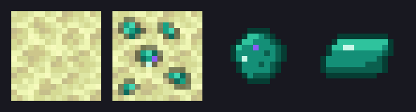

# Endrise

**The End update, one tide at a time.**

Endrise is a NeoForge mod that grows the End into a place worth staying, built around one promise: **nothing is lost**. It starts with something buried in the ground and ends with the ground remembering you. Eight tides, one arc, and every piece of it earns its place in survival.



## The covenant, start to finish (v1.0)

- **Buried Light.** Enderium Ore generates in end stone across every End biome. Diamond pickaxe required; Fortune scales the raw drops, Silk Touch takes the block. Since v1.0 the veins are quietly awake: exposed enderium sheds slow reverse-portal motes and hums, so you'll see a vein before you can read its texture.
- **The tier above.** Raw enderium smelts into ingots; the Enderium Upgrade Smithing Template turns netherite gear into **enderium gear** at the smithing table, the same way diamond became netherite. Enchantments and durability carry.
- **Soulbound.** An anvil-only enchantment. Die, and eight seconds later the bound gear teleports back into the slots it left. Survives restarts, void deaths included. The covenant honors the mark on any metal, but the anvil only grants it to enderium: marked iron and diamond come from somewhere else. Read on.
- **The Void Gives Back.** Enderium you lose, tossed off an island, dropped to the despawn timer, burned, returns to you. Ender pearls cost no damage in enderium armor.
- **Set in Stone.** The End learns masonry: polished end stone and tile families with full stonecutter support, the chiseled Mourner's Relief, Blocks of Enderium (beacon base), and the Enderium Lantern whose teal embers drift upward.
- **Mourning Blooms.** Deaths in the End sprout flowers on the nearest end stone; your friends find your death sites before you tell the story. Blooms craft Void Petals; petal + bottle is the **Draught of Return**: drink, wander ninety seconds, snap back to where you drank. End-only.
- **The Cenotaphs.** Past the void gaps, small ruins: memorial stonework, blooms, a lantern still burning over a grave slab. In every chest, one named, worn piece of gear from a traveler who never made it home, often still Soulbound, rarely enderium itself. The renewable source of upgrade templates. No mobs. The silence is the point.
- **The Way Home.** The **Homeward Pearl** (ender pearl wrapped in petals and ingots): use it anywhere, in any dimension, and arrive at your own respawn point. Consumed on use, five-second cooldown, and it can never roll the credits: that belongs to the portal. After your gear, your drops, and everyone else's graves, it's your turn.

An eight-node advancement tab walks the whole arc, Buried Light through The Way Home.

## Playing it

Grab the jar matching your Minecraft version from [Releases](https://github.com/bentenavery/endrise/releases), drop it in the `mods/` folder of a NeoForge instance. Or build from source:

```bash
./gradlew build
```

The jar lands in `build/libs/` and goes in the `mods/` folder of any matching NeoForge instance.

## Versions

| Branch | Minecraft | NeoForge |
|---|---|---|
| `main` (dev tip) | 26.1.2 | 26.1.2.87+ |
| `1.21.1` | 1.21.1 | 21.1.244+ |

New content lands on `main` first, then gets ported. Releases ship one jar per supported version.

## Help tune the numbers

Every number in the mod is a first guess, not a verdict: vein density, cenotaph spacing and loot rates, bloom density, draught duration, the pearl recipe cost. If something feels too cheap, too grindy, or too safe, [open an issue](https://github.com/bentenavery/endrise/issues) and say what you did and what felt wrong. Real playtime beats theorycrafting.

## Contributing

Endrise is open to contributors. The plan lives in [ROADMAP.md](ROADMAP.md), the how lives in [CONTRIBUTING.md](CONTRIBUTING.md), and the dev loop is one command:

```bash
./gradlew runClient
```

## License

[MIT](LICENSE).
